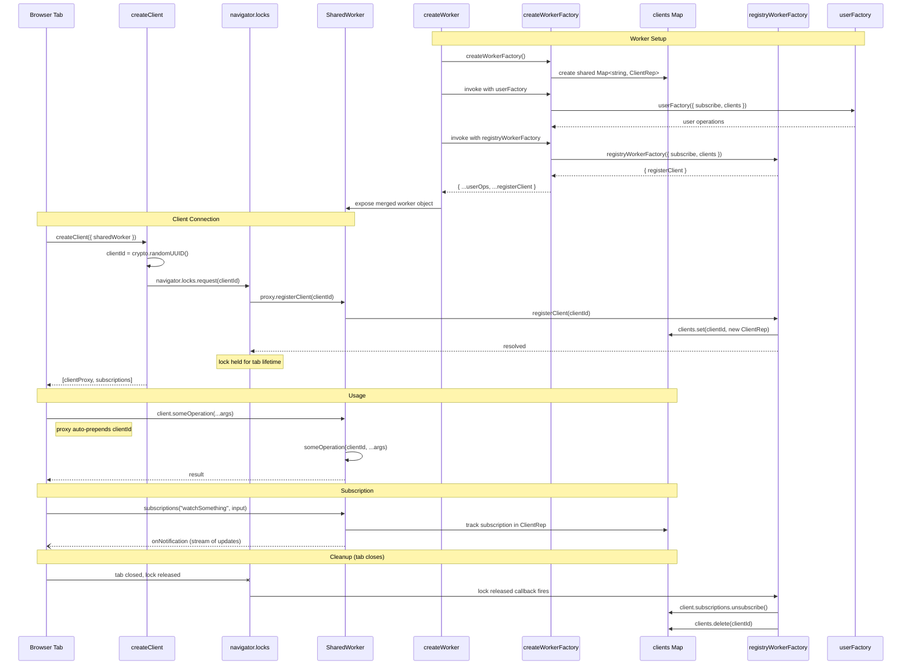

# Internals

How `createWorkerFactory`, `registryWorkerFactory`, and `createWorker` compose to produce a SharedWorker, and how `createClient` connects from a browser tab.

## Lifecycle

1. **Worker setup** -- `createWorker` calls `createWorkerFactory()`, which allocates a single shared `clients` map. It then invokes both the user-provided factory and `registryWorkerFactory` with the same `WorkerContext` (`{ subscribe, clients }`), merging their results into one worker object.

2. **Client connection** -- `createClient` generates a `clientId`, acquires a `navigator.locks` Web Lock for that id, and calls `registerClient` on the worker. The worker adds the client to the shared map. The lock is held for the lifetime of the tab.

3. **Usage** -- The returned client proxy intercepts every call and auto-prepends `clientId`, so worker operations always know which client is calling. Subscriptions are tracked per-client via `ClientRep.subscriptions`.

4. **Cleanup** -- When a tab closes (or navigates away), the browser releases the Web Lock. The worker detects this, unsubscribes all of that client's subscriptions, and removes the client from the map.
